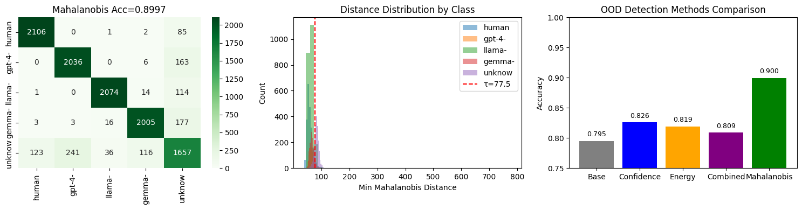

# Mahalanobis OOD Detection for AI-Generated Text Classification

**NLP Semester Project** | [Competition](https://codalab.lisn.upsaclay.fr/competitions/21895) | [Paper](https://arxiv.org/abs/2508.09622) | [GigaCheck](https://arxiv.org/abs/2410.23728)

Extension of AINL-Eval 2025 winning solution with **Mahalanobis OOD detection** for unknown AI model identification.


## Results

| Model | Params | Size | Inference | Accuracy |
|-------|--------|------|-----------|----------|
| [sastsy (1st place)](https://arxiv.org/abs/2508.09622) | - | - | - | 91.22% |
| **Qwen2.5-7B + Mahalanobis** | 7.61B | 15 GB | ~300ms (GPU) | **89.97%** |
| adugeen (2nd place) | - | - | - | 86.96% |
| ruBERT-tiny2 + Mahalanobis | 29M | 118 MB | ~3ms (GPU) | 85.25% |
| TF-IDF baseline | - | - | - | 80.81% |

**Key finding**: ruBERT-tiny2 achieves **85.25%** accuracy -- only 4.7% below Qwen, but **100x faster** and **127x smaller**.

## Method

### 1. Dual-Head Architecture
Following [GigaCheck](https://arxiv.org/abs/2410.23728) and sastsy:
- **Binary head**: human vs AI
- **Multiclass head**: GPT-4 / Llama / Gemma / unknown (via OOD detection)

### 2. Mahalanobis OOD Detection
- Computes distance to class centroids in embedding space
- Detects unknown AI models (GigaChat-Lite, DeepSeek-V3) not seen during training
- **+10.4%** accuracy improvement over softmax confidence baseline



### 3. Knowledge Distillation
- **Teacher**: Qwen2.5-7B (7.61B params)
- **Student**: ruBERT-tiny2 (29M params)

## Repository Structure

```
├── README.md
├── requirements.txt
├── .gitignore
├── ai_text_detection.ipynb       # Main notebook (with outputs)
├── data/
│   ├── train.csv                 # 35,158 samples (4 classes)
│   ├── dev_full.csv              # 10,979 samples (5 classes)
│   └── test.csv                  # 6,169 samples (no labels)
├── images/                       # Figures for README
│   ├── results.png
│   └── mahalanobis.png
└── reports/
    ├── report.tex                # LaTeX report
    └── report.pdf                # PDF report
```

## Quick Start

### 1. Clone repository
```bash
git clone https://github.com/dpGorbunov/nlp-sem-project.git
cd nlp-sem-project
```

### 2. Install dependencies
```bash
pip install -r requirements.txt
```

### 3. Download models (for re-training)
```bash
mkdir -p models && cd models

# Qwen2.5-7B-Instruct (~15GB)
huggingface-cli download Qwen/Qwen2.5-7B-Instruct --local-dir Qwen:Qwen2.5-7B-Instruct

# ruBERT-tiny2 (~118MB)
huggingface-cli download cointegrated/rubert-tiny2 --local-dir rubert-tiny2_
```

### 4. Run experiments
Open `ai_text_detection.ipynb` in Jupyter. The notebook includes pre-computed outputs.

**Hardware for re-training**: NVIDIA GPU with 40GB+ VRAM (A100 recommended), ~13 hours.

## Links

- **Competition**: [AINL-Eval 2025 on CodaLab](https://codalab.lisn.upsaclay.fr/competitions/21895)
- **Paper**: [arXiv:2508.09622](https://arxiv.org/abs/2508.09622)
- **GigaCheck**: [arXiv:2410.23728](https://arxiv.org/abs/2410.23728)
- **Qwen2.5**: [Hugging Face](https://huggingface.co/Qwen/Qwen2.5-7B-Instruct)
- **ruBERT-tiny2**: [Hugging Face](https://huggingface.co/cointegrated/rubert-tiny2)
- **Mahalanobis OOD**: [Lee et al., NeurIPS 2018](https://arxiv.org/abs/1807.03888)

## Citation

```bibtex
@misc{gorbunov2026mahalanobis,
  author = {Gorbunov, Dmitry},
  title = {Mahalanobis OOD Detection for AI-Generated Text Classification},
  year = {2026},
  publisher = {GitHub},
  url = {https://github.com/dpGorbunov/nlp-sem-project}
}
```

## Author

**Dmitry Gorbunov** -- ITMO University, Institute of Applied Computer Science, Master's student in AI (1st year)

## License

MIT
